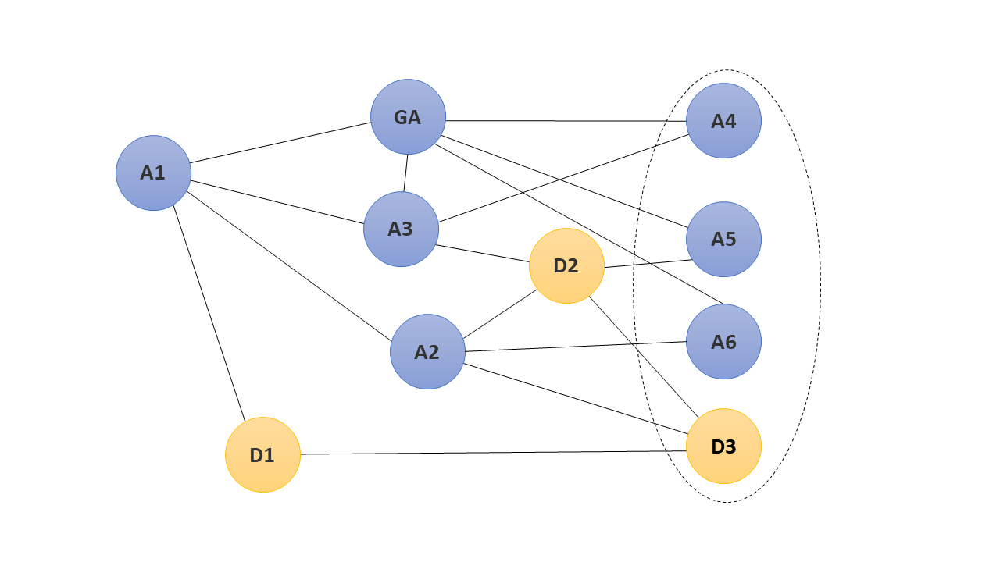

# A Blockchain for vaccinations

[](http://blockchain-vaccination-records.readthedocs.io/en/latest/?badge=latest)
[](https://travis-ci.org/toniSta/blockchain_vaccination_records)
[](https://coveralls.io/github/toniSta/blockchain_vaccination_records?branch=master)

This project is about the idea to store vaccination records anonymously and publicly available as a blockchain.
It provides a prototype to demonstrate the principal functionality.
It solves the problem of an effective, scalable consensus protocol by exploiting general assumptions within the domain of vaccinations.
You will find an implementation of a prototype to demonstrate the general functionality.

- [Getting Started](#getting-started)
   - [Prerequisites](#prerequisites)
   - [Installing](#installing)
- [Running the tests](#running-the-tests)
- [Deployment of the demonstration](#deployment-of-the-demonstration)
   - [How to interact within the demonstration](#how-to-interact-within-the-demonstration)
- [Architecture](architecture.md#architecture) `external`
   - [Network Participants](architecture.md#network-participants)
   - [Supported Transactions](architecture.md#supported-transactions)
   - [Client Types](architecture.md#client-types)
- [Consensus](consensus.md#consensus) `external`
   - [Judgements](consensus.md#judgements)
   - [Creator Election](consensus.md#creator-election)
   - [Synchronization](consensus.md#synchronization)
- [Known Limitations](#known-limitations)
- [Recreating the genesis block](#recreating-the-genesis-block )
- [Code Documentation](#code-documentation)
- [Versioning](#versioning)
- [Authors](#authors-(alphabetical))
- [License](#license)
- [Acknowledgments](#acknowledgments)

## Getting Started

These instructions will get you a copy of the project up and running on your local machine for development and demonstration 
purposes.

### Prerequisites

The prototype is implemented with Python 3.x. We recommend a version >= 3.6.
We use Docker to deploy our demonstration. 
You will need to install `docker` (>= 17.10) and `docker-compose` (>=1.16).
We visualize the current chain state as a PNG image. 
You may want to install an image viewer which is able to refresh the opened image. 
On Windows, we recommend [JPEGView](https://sourceforge.net/projects/jpegview/).

### Installing

First of all you'll need to get a copy of the project:

```bash
git clone https://github.com/toniSta/blockchain_vaccination_records.git
cd blockchain_vaccination_records
```

Continue by installing the projects python requirements:

```bash
pip install -r requirements.txt
```

Now you are prepared to run the [tests](#running-the-tests) or to [deploy](#deployment) the demo.

## Running the tests

[](https://travis-ci.org/toniSta/blockchain_vaccination_records)
[](https://coveralls.io/github/toniSta/blockchain_vaccination_records?branch=master)

You can run the tests with `pytest` within the root directory of the repository.

To get a report about the test coverage, run:
```bash
pytest --cov blockchain tests --cov-report=html
```
You'll find the report within the subdirectory `htmlcov`.

## Deployment of the demonstration

We use `docker` and `docker-compose` to deploy the demo of this application.
Before running the demonstration, you have to build the images used by the demo (both in the root directory):

```bash
docker build -t blockchain_base -f base.Dockerfile .
docker build -t full_client_image -f Full_Client.Dockerfile .
```

After building the base image you can run `docker-compose up` to start the demo network.
This will start and connect the following network (nodes GA, A1-3, D1-2; see [Network Participants](architecture.md#network-participants))



The nodes `A4-6` and `D3` can be controlled by you (see [How to interact within the demonstration](#how-to-interact-within-the-demonstration)). 
You can start them with the following commands (one per window):
```bash
./start_a4.sh
./start_a5.sh
./start_a6.sh
./start_d3.sh
```

To stop the demonstration you can stop the compose network by hitting `Ctrl+C`. After the containers were stopped successfully
you can run `./stop_and_clean.sh` to stop the additional clients and clean up the docker environment.
Most certainly you also want to delete the contents of the directory `blockchain/blockchain_files`. 
However, don't delete the file starting with `0_` (You can restore the file with `git checkout blockchain/blockchain_files/`).

### How to interact within the demonstration
**Current state of the blockchain**

First of all you can have a look on the state of the blockchain as seen by the `GA` node. 
It will store its files in the directory `blockchain/blockchain_files`.
It will also contain an image `current_state.png`. 
This is a rendered image of the current chain. 
It will be renewed whenever the `GA` node adds a block to its chain.
You may want to use an image viewer with an auto-refresh feature (see [Prerequisites](#prerequisites)).

**Interactive clients**

Furthermore, there are 3 types of clients that can be controlled by you.
We use environment variables inside the docker container  to specify which client should be started.

- Create Block at any time (`A4`)  
This client will you allow to create blocks independently from the normal creator election.
This client will start with the following environment variables `REGISTER_AS_ADMISSION=1` and `START_CLI=1`.
- Confirm to broadcast a created block (`A5` + `A6`)  
This kind of client will register itself as admission node (see [Network Participants](architecture.md#network-participants)).
It will generate block if it is its turn.
It won't broadcast this block immediately.
It will ask you for confirmation before broadcasting the block.
You can start it with the environment variables `REGISTER_AS_ADMISSION=1` and `CONFIRM_BLOCKSENDING=1`.
- Create and submit transactions (`D3`)  
This node lets you create any kind of transaction, see [Supported Transactions](architecture.md#supported-transactions). 
The node `D3` has a uni-directional connection to the nodes `A1-3` and `GA`. 
This means it will send new transactions to all admission nodes (see [Network Participants](architecture.md#network-participants)) of the base network.
You can start this kind of client by setting the environment variable `START_CLI=1`.

There are some more environment variables to setup the nodes:

- `NEIGHBORS_HOST_PORT`  
This is a `,`-separated list of the nodes neighbors. 
Entries contain the (resolvable) hostname/ip and port the neighbor listens on (default is `9000`).
A list may look like this: `a2:9000,d2:9000`.
If you want to extend the demo network, keep in mind that you need at least 1 bi-directional connection to the existing network.
- `SERVER_PORT`  
This is the port the client listens on (defaults to `9000`).
- `RENDER_CHAIN_TREE`  
If set to `1` the client will render the chain as an image.

You can also add host volumes to the client. 
These are the directories inside the container that can be replaced with a hostmount:

- `/app/blockchain/blockchain_files`  
This is the directory where the container will store its blockchain. 
Keep in mind that the hostmount directory must contain the genesis block before starting the container.
Don't use `blockchain/blockchain_files`.
This directory is reserved  for the `GA` node.
Example: `/path/to/directory/containing/genesis_block:/app/blockchain/blockchain_files`
- `/app/blockchain/keys`  
This directory contains the keys used by the client. 
In most cases you don't need to replace the directory by a hostmount.
The directory `blockchain/keys` is reserved by the `GA` node.

**Start own nodes**

You can start your own clients. 
You have to connect them to the existing network manually by extending the `NEIGHBORS_HOST_PORT` variable of the nodes you want to connect to.
This is the base command that starts a client:
```bash
docker run --name custom_client -it -p 9000 --network blockchainvaccinationrecords_default full_client_image
```
Replace `custom_client` with the name of the client. 
This name will also be resolvable by other clients.
If you changed the default directory name of the repository, you also need to change `blockchainvaccinationrecords_default`.
You can run `docker network ls` to get a list of the created networks after starting `docker-compose`.
With `-e` you can add environment variables (e.g. `-e "START_CLI=1"`).
`-v` will add hostmounts (e.g. `-v /absolute/path:/app/blockchain/blockchain_files`).
Both flags can be repeated to add multiple environment variables or mounts.

**Get bash access for the clients `A4-6` and `D3`**

You can use one of the following commands to get a bash terminal inside the container:

```bash
docker exec -it a4 bash
docker exec -it a5 bash
docker exec -it a6 bash
docker exec -it d3 bash
```

You will find the debug logs in `/var/log/blockchain/server.log`.
The blockchain files are located in the former mentioned directories.


**Stopping network nodes**

You can stop nodes of the base network and restart them at a later time.

Commands to stop nodes:
```bash
docker-compose stop genesis_admission
docker-compose stop a1
docker-compose stop a2
docker-compose stop a3
docker-compose stop d1
docker-compose stop d2
```

Use `docker-compose start <name>` to start the node again.

## Known Limitations

- If the requested block is not part of the chain of the asked neighbor the complete chain needs to be resent.
 To solve this you would need to remember which blocks were part of a dead branch.
- If the peer-to-peer networks is split up into two separate networks (e.g. A1, D1 and D3 in the example network) 
 it won't synchronize the separate networks after reconnecting them.
- If one admission node is broken and creates false deny judgements, it won't recover by itself. 
 However, the network itself is still working (as long as at least half of the admission nodes work properly).
- We trust doctor nodes. Currently they could drive a denial of service attack by creating random users and vaccination records
- Approvals for the registration of doctor or admission nodes are susceptible to replay attacks as they currently have no indication of which transaction they belong to. To mitigate this you would need to add some transaction identifier to the approval.
- The complete blockchain is kept in memory ultimately letting the application exhaust its memory. To prevent this you would need to only load the necessary blocks from disk on demand.
- Most of the serialization for network transfer is done with `repr()`. The de-serialization uses `eval()`.
 This allows code injections in an extremely easy way. This has to be changed to a more secure serialization if you 
 consider a more productive scenario!

## Recreating the genesis block

It may happen that you want to generate a new genesis block.
With the following command you can create a new keypair for the genesis admission and recreate the genesis block:

```bash
python recreate_genesis_block.py
```

## Code Documentation

[](http://blockchain-vaccination-records.readthedocs.io/en/latest/?badge=latest)

We use python doc strings inside the source files. Each method has its own documentation. You can find an online version at [readthedocs.io](http://blockchain-vaccination-records.readthedocs.io/en/latest/?badge=latest).

You can create an offline documentation with the following commands.
You will find the documentation in `docs/build/html`:
```bash
cd docs
make html # on *nix systems
make.bat html # on windows
```

> *Notice*
>
> We are using `sphinx` to generate the documentation.
> `sphinx` is not able to include inner (private) classes into the documentation.
> Please refer to the code for a full documentation of singletons.

## Versioning

We use [SemVer](http://semver.org/) for versioning. For the versions available, see the 
[tags on this repository](https://github.com/toniSta/blockchain_vaccination_records/tags). 

## Authors (alphabetical)

|Name   	        | Work   	        | Profile   	                                |
|---	            |---	            |---	                                        |
|Benedikt Bock   	|Initial work   	|[Benedikt1992](https://github.com/Benedikt1992)|
|Alexander Preuß   	|Initial work   	|[alpreu](https://github.com/alpreu)            |
|Toni Stachewicz   	|Initial work   	|[toniSta](https://github.com/toniSta)          |

## License
This project is licensed under the GNU General Public License v3.0 - see the [LICENSE](LICENSE) file for details

Copyright (C) 2018  Benedikt Bock, Alexander Preuß, Toni Stachewicz

## Acknowledgments

We would like to thank [chrboehm](https://github.com/chrboehm) for the support during the development of this prototype.
